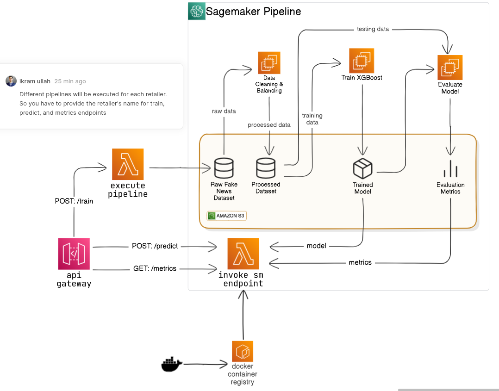

# 🚀 XGBoost Turnover Forecasting Pipeline on AWS SageMaker

[]()
[]()
[]()

A fully automated AWS SageMaker Pipeline that trains and deploys an XGBoost model to forecast product turnover days for individual retail partners. On demand, each retailer can trigger a fresh training run and receive a serverless inference endpoint—no manual DevOps hand-offs required.

---

## 📖 Table of Contents

1. [Architecture Diagram](#architecture-diagram)  
2. [Prerequisites](#prerequisites)  
3. [Pipeline Components](#pipeline-components)  
4. [API & Lambda Integration](#api--lambda-integration)  
5. [License](#license)

---

## 🏗️ Architecture Diagram



1. **API Gateway & Start-Training Lambda**    
2. **SageMaker Pipeline**: data cleaning → train XGBoost → evaluate
3. **Predict-Turnover Lambda** for serverless inference  
4. **Get-Metrics Lambda** for health & performance

---

## ⚙️ Prerequisites

- Python 3.8+
- AWS CLI v2 configured with an IAM user/role that has access to SageMaker, S3, IAM, CloudWatch
- IAM roles for SageMaker Pipeline and Lambda functions
- Docker (custom containers for inference lambda)

```bash
aws configure            # set AWS_PROFILE, AWS_REGION, etc.
```

---

## 🔍 Pipeline Components

All core pipeline logic lives in `pipeline.py` using the SageMaker Python SDK v2:

1. **Data Cleaning & Balancing** (`ProcessingStep`):
   - Reads raw CSVs from `s3://$S3_BUCKET/raw/`
   - Applies filtering, null‐value handling, and class rebalancing
   - Writes train/validation/test splits to `s3://$S3_BUCKET/processed/`

2. **Train XGBoost Model** (`TrainingStep`):
   - Launches an XGBoost training job
   - Outputs artifacts to `s3://$S3_BUCKET/models/<retailer>`

3. **Evaluate Model** (`ProcessingStep`):
   - Loads test split, computes RMSE or custom business metrics
   - Exposes results as JSON in the pipeline execution

---

## 🔗 API & Lambda Integration

We expose three simple REST endpoints via API Gateway + AWS Lambda:

| Path            | Method | Description                              |
|-----------------|--------|------------------------------------------|
| `/train`        | POST   | Trigger the SageMaker pipeline for a specific retailer. Body: `{ "retailer": "Acme" }` |
| `/predict`      | POST   | Invoke the live endpoint. Body: product features JSON |
| `/metrics`      | GET    | Fetch the latest evaluation metrics for the retailer’s model |


---

## 📜 License

MIT License. See [LICENSE](LICENSE) for details.